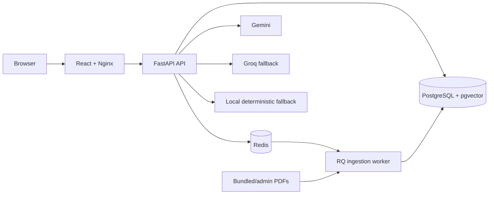

# Gita GPT Platform

[](https://github.com/Anishhar03/gitagpt/actions/workflows/ci.yml)
[](https://render.com/deploy?repo=https://github.com/Anishhar03/gitagpt)

Gita GPT is a source-grounded Bhagavad Gita study platform built to grow from a local demo to a multi-user service. It combines a responsive React workspace, a versioned FastAPI API, PostgreSQL with pgvector, Redis-backed jobs and rate limits, and an AI provider chain with a deterministic no-key mode.

The bundled Gita PDF is indexed automatically. Every answer includes the passages used to create it, and the app still works without a paid AI key.

## Capabilities

- Persistent users, conversations, messages, feedback, and bookmarks.
- Hybrid retrieval using pgvector similarity plus lexical relevance.
- Gemini as the primary generator, Groq as fallback, and deterministic local answers as the final fallback.
- Background PDF ingestion with RQ workers and admin document upload.
- Google OIDC-ready authentication and a development login for local use.
- Daily wisdom, passage citations, source drawers, Markdown exports, and conversation archiving.
- Responsive desktop and mobile UI with accessible loading, empty, error, and navigation states.
- Health and readiness probes, Prometheus metrics, structured logs, request IDs, and Redis rate limits.
- Alembic migrations, non-root containers, backend tests, frontend tests, and full container smoke testing in CI.

## Architecture



The API is stateless and can be replicated. PostgreSQL owns durable state, Redis owns transient coordination, and workers scale independently from user traffic. See [docs/ARCHITECTURE.md](docs/ARCHITECTURE.md) for request flows, failure behavior, and the path from 100 to 10,000 users.

## Quick Start

Requirements: Docker Desktop with Compose v2.

```bash
git clone https://github.com/Anishhar03/gitagpt.git
cd gitagpt
cp .env.example .env
docker compose up --build
```

Open [http://localhost:3000](http://localhost:3000). The default development account is created when you enter a display name. The bundled PDF is queued on first startup; the admin view shows its indexing status.

No AI key is required. To enable hosted models, set either or both values in `.env`:

```dotenv
GOOGLE_API_KEY=your_key
GROQ_API_KEY=your_key
```

The provider order is Gemini, Groq, then local. A provider failure is contained to the current request and automatically advances to the next provider.

Stop and remove local data with:

```bash
docker compose down -v
```

## Deploy on Render

`render.yaml` defines a free demonstration stack with a static web app, Docker API, Render Postgres, and Render Key Value in Singapore. It uses `INGESTION_MODE=inline` because free background-worker instances are unavailable. The normal Compose deployment continues to use the separate RQ worker.

Click the **Deploy to Render** button above or follow [docs/DEPLOYMENT.md](docs/DEPLOYMENT.md). The public demo disables document administration and uses isolated anonymous visitor identities. Render's free PostgreSQL database expires after 30 days; choose a paid database before treating the deployment as durable.

## Local Development

Start PostgreSQL and Redis:

```bash
docker compose up -d postgres redis
```

Run the API and worker in separate terminals:

```bash
python -m venv .venv
source .venv/bin/activate
python -m pip install -r backend/requirements-dev.txt
cd backend
alembic upgrade head
uvicorn app.main:app --reload
```

```bash
cd backend
rq worker ingestion --url redis://localhost:6379/0
```

Run the frontend:

```bash
cd frontend
npm ci
npm run dev
```

On Windows, activate the environment with `.\.venv\Scripts\Activate.ps1`. For host-based backend development, change `DATABASE_URL` and `REDIS_URL` in `.env` from the Compose service names to `localhost`.

## Verification

```bash
cd backend
ruff check app tests
pytest --cov=app --cov-fail-under=70

cd ../frontend
npm run lint
npm test
npm run build

cd ..
python scripts/verify_project.py
python scripts/smoke_test.py
```

`smoke_test.py` expects the Compose stack to be running. It validates readiness, the web app, authentication, document ingestion, retrieval, local generation, citations, feedback, bookmarks, daily wisdom, and export.

## Configuration

| Variable | Default | Purpose |
|---|---|---|
| `AUTH_MODE` | `development` | Use `google` in production. |
| `JWT_SECRET` | local value | Signing key; replace in every deployed environment. |
| `ADMIN_EMAILS` | `admin@gitagpt.local` | Comma-separated upload administrators. |
| `GOOGLE_CLIENT_ID` | blank | Google Identity Services client ID. |
| `GOOGLE_API_KEY` | blank | Gemini generation and embedding key. |
| `GROQ_API_KEY` | blank | Groq generation fallback key. |
| `RATE_LIMIT_PER_MINUTE` | `20` | Per-user chat limit. |
| `RETRIEVAL_TOP_K` | `6` | Source passages returned per question. |
| `INGESTION_MODE` | `queue` | Use `inline` only where a separate worker is unavailable. |

All settings are documented in [`.env.example`](.env.example) and [docs/DEPLOYMENT.md](docs/DEPLOYMENT.md).

## Repository Map

```text
backend/                 FastAPI, SQLAlchemy, RQ, migrations, tests
frontend/                React, Vite, responsive UI, component tests
docs/                    Architecture, API, deployment, operations, security
scripts/smoke_test.py    Running-stack contract test
scripts/verify_project.py Static structure, syntax, and secret check
docker-compose.yml       Local production-shaped stack
app.py                   Original Streamlit proof of concept (legacy)
```

The original Streamlit proof of concept remains in `app.py` for comparison. Its dependencies are isolated in `requirements-legacy.txt`; it is not part of the production platform or CI path.

## Documentation

- [Architecture](docs/ARCHITECTURE.md)
- [API contract](docs/API.md)
- [Deployment](docs/DEPLOYMENT.md)
- [Operations](docs/OPERATIONS.md)
- [Security](docs/SECURITY.md)
- [Workflows](docs/WORKFLOWS.md)
- [Code walkthrough](docs/CODE_WALKTHROUGH.md)

## Security

Never commit `.env`, API keys, OAuth secrets, or production signing keys. Rotate any credential that has been pasted into chat, a terminal transcript, or a public issue. The repository verifier scans common GitHub, Groq, and Google key formats before publishing.

No license is currently included. Add one before accepting external contributions.
