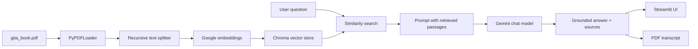

# Gita GPT

Gita GPT is an end-to-end Streamlit application that answers reflective questions with Retrieval-Augmented Generation over the Bhagavad Gita. It retrieves relevant passages from `gita_book.pdf`, sends the grounded context to Gemini, and returns a calm, practical response with source passages and a downloadable chat transcript.


## What It Does

- Collects seeker context: name, age, and intention.
- Loads the Bhagavad Gita PDF and chunks it into searchable passages.
- Embeds passages with Google Generative AI embeddings.
- Stores and reuses the local Chroma vector index in `gita_chroma/`.
- Retrieves the most relevant passages for each question.
- Sends retrieved context to Gemini for a grounded answer.
- Shows source passages used for the response.
- Exports the conversation as a PDF transcript.
- Runs locally, in Docker, on Streamlit Community Cloud, or on a container host.

## Architecture



## Quick Start

### 1. Clone and enter the project

```bash
git clone https://github.com/Anishhar03/gitagpt.git
cd gitagpt
```

### 2. Create a virtual environment

Windows PowerShell:

```powershell
python -m venv .venv
.\.venv\Scripts\Activate.ps1
```

Linux/macOS:

```bash
python -m venv .venv
source .venv/bin/activate
```

### 3. Install dependencies

```bash
python -m pip install --upgrade pip setuptools wheel
python -m pip install -r requirements.txt
```

### 4. Configure secrets

Copy the example file:

```bash
cp .env.example .env
```

Set your Google API key:

```bash
GOOGLE_API_KEY=your_google_gemini_api_key_here
```

Never commit `.env`.

### 5. Run the app

```bash
streamlit run app.py
```

Open:

```text
http://localhost:8501
```

## Environment Variables

| Variable | Required | Default | Meaning |
|---|---:|---|---|
| `GOOGLE_API_KEY` | Yes | none | Google Generative Language API key used by Gemini and embeddings. |
| `GITA_GPT_MODEL` | No | `gemini-1.5-flash` | Chat model used for answer generation. |
| `GITA_GPT_EMBEDDING_MODEL` | No | `models/embedding-001` | Embedding model used for vector retrieval. |
| `GITA_GPT_CHUNK_SIZE` | No | `1000` | Character target for each PDF chunk. |
| `GITA_GPT_CHUNK_OVERLAP` | No | `150` | Character overlap between chunks to preserve context. |
| `GITA_GPT_TOP_K` | No | `4` | Number of retrieved passages sent to Gemini. |

## Deployment

### Streamlit Community Cloud

1. Push this repo to GitHub.
2. Open Streamlit Community Cloud.
3. Create a new app from the GitHub repo.
4. Main file: `app.py`.
5. Add `GOOGLE_API_KEY` in Streamlit Secrets.
6. Deploy.

### Docker

```bash
docker build -t gita-gpt .
docker run --rm -p 8501:8501 -e GOOGLE_API_KEY=your_key_here gita-gpt
```

Then open:

```text
http://localhost:8501
```

Full deployment notes are in [docs/DEPLOYMENT.md](docs/DEPLOYMENT.md).

## Documentation

- [docs/WORKFLOWS.md](docs/WORKFLOWS.md): user, RAG, transcript, and deployment workflows.
- [docs/CODE_WALKTHROUGH.md](docs/CODE_WALKTHROUGH.md): meaning of each major block in `app.py`.
- [docs/DEPLOYMENT.md](docs/DEPLOYMENT.md): local, Streamlit Cloud, Docker, and troubleshooting guide.

## Project Structure

```text
.
|-- app.py
|-- gita_book.pdf
|-- krishna_ji.jpeg
|-- requirements.txt
|-- .env.example
|-- .streamlit/config.toml
|-- Dockerfile
|-- runtime.txt
|-- docs/
|   |-- CODE_WALKTHROUGH.md
|   |-- DEPLOYMENT.md
|   `-- WORKFLOWS.md
`-- scripts/
    `-- verify_project.py
```

## Validation

Run the lightweight repository check:

```bash
python scripts/verify_project.py
```

Run the app:

```bash
streamlit run app.py
```

Expected behavior:

1. The landing page and profile form load.
2. You enter name, age, and intention.
3. The chat opens and prepares the Gita knowledge base.
4. A question retrieves Gita passages.
5. Gemini returns a grounded answer.
6. Retrieved sources are visible.
7. Transcript PDF download works after messages exist.

## Security Notes

- Do not commit `.env` or real API keys.
- The vector cache `gita_chroma/` is generated runtime data and is ignored by Git.
- If a Google key is exposed publicly, revoke it or restrict it immediately in Google Cloud Console.
- For public deployments, restrict the API key to the Generative Language API and trusted referrers or infrastructure where possible.

## Troubleshooting

| Problem | Fix |
|---|---|
| `GOOGLE_API_KEY` missing | Set it in `.env`, shell env, or Streamlit Secrets. |
| Chroma sqlite error | On Linux, `pysqlite3-binary` is installed and shimmed automatically. |
| Chroma cache error | The generated `gita_chroma/` cache is rebuilt automatically when it is incompatible. |
| Google connection error | Check API key restrictions, quota, Generative Language API access, and outbound network access. |
| PDF not found | Keep `gita_book.pdf` in the project root. |
| Background missing | Keep `krishna_ji.jpeg` in the project root. |
| Gemini quota error | Check Google API key, billing/quota, and Generative Language API access. |
| Slow first answer | The first run may create the vector store; later runs reuse `gita_chroma/`. |

## License

No license has been selected yet. Add one before accepting external contributions.
