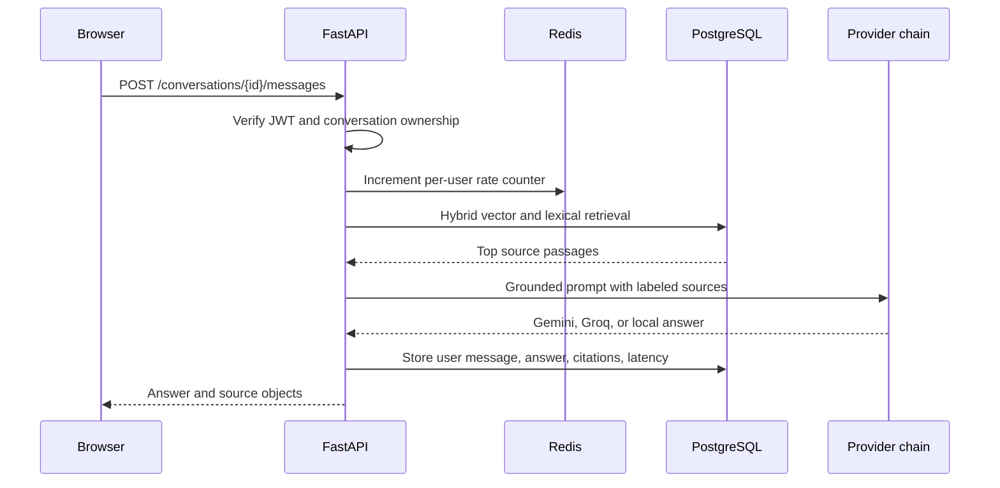
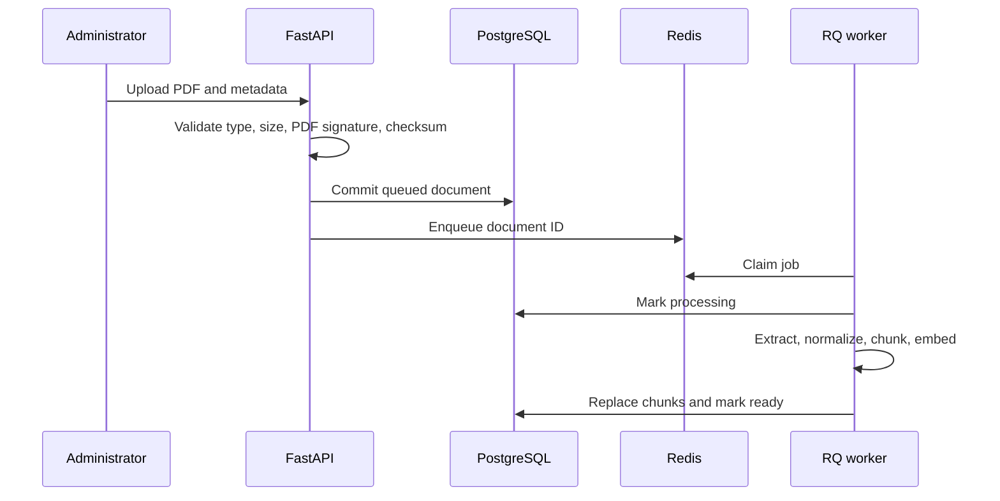

# Architecture

## Goals

Gita GPT is designed for a practical 100 to 10,000-user range without splitting a small product into premature microservices. It is a modular monolith deployed as three process types: web, API, and worker. Their scaling and failure domains are separate even though the backend shares one codebase.

## Components

| Component | Responsibility | State |
|---|---|---|
| React web | Navigation, chat, citations, bookmarks, admin uploads | Browser session only |
| FastAPI API | Auth, authorization, retrieval, generation, persistence | Stateless |
| RQ worker | PDF extraction, chunking, embedding, indexing | Stateless |
| PostgreSQL | Users, content, conversations, vectors | Durable source of truth |
| Redis | Job queue, daily cache, rate-limit counters | Rebuildable/transient |
| Gemini/Groq/local | Answer generation provider chain | External/local computation |

## Answer Flow



Sources are persisted with each assistant message. Historical answers therefore retain the exact passages shown at generation time even when the knowledge base later changes.

## Ingestion Flow



The document is committed before the job is enqueued, preventing workers from racing an uncommitted row. Checksums make uploads idempotent. Failed jobs preserve a concise error on the document record for operators.

## Retrieval

Documents are split into overlapping, sentence-aware chunks. Embeddings use Gemini when configured and a stable hash embedding otherwise. PostgreSQL retrieves a wider semantic candidate set with an HNSW cosine index. The API reranks candidates with a weighted score:

```text
score = semantic cosine similarity * 0.78 + lexical overlap * 0.22
```

The lexical component helps exact terms survive semantic ambiguity. Local SQLite tests use the same reranker over a bounded scan, so contract behavior can be verified without PostgreSQL.

## Provider Failure Policy

The provider chain is assembled from available credentials:

1. Gemini, when `GOOGLE_API_KEY` is set.
2. Groq, when `GROQ_API_KEY` is set.
3. Local deterministic grounded response, always available.

Empty output, timeout, or provider error records a failure metric and advances to the next provider. Retrieval failure does not generate an ungrounded answer; it returns `503` until at least one document is ready.

## Consistency and Ownership

- PostgreSQL transactions own durable writes.
- Conversation queries include the authenticated user ID; another user's UUID is insufficient for access.
- Upload administration is role-gated.
- Redis loss can temporarily affect jobs, caching, and limits but does not erase conversations or documents.
- API instances do not own local session state and can sit behind a load balancer without sticky sessions.

## Scaling Path

At roughly 100 users, one API instance, one worker, managed PostgreSQL, and managed Redis are sufficient. Add connection pooling and database backups first.

At roughly 1,000 users, run multiple API replicas, two or more workers, PgBouncer, centralized logs, and alerting on latency, errors, queue age, and provider failures.

Toward 10,000 users, autoscale API and workers independently, place the web bundle behind a CDN, use Redis high availability, use PostgreSQL read replicas for analytical workloads, partition large message tables if measurements justify it, and move uploaded PDFs to object storage. Keep retrieval writes on the primary and avoid adding services until ownership or scaling data requires them.

## Extension Points

- Add translations through the existing document metadata and ingestion contract.
- Add a reranker behind `retrieve_sources` without changing API schemas.
- Add model providers by implementing `generate(prompt)` and registering them in `ProviderChain`.
- Replace filesystem storage with S3-compatible storage behind `services/storage.py`.
- Move answer generation to asynchronous jobs only if observed model latency requires it.
